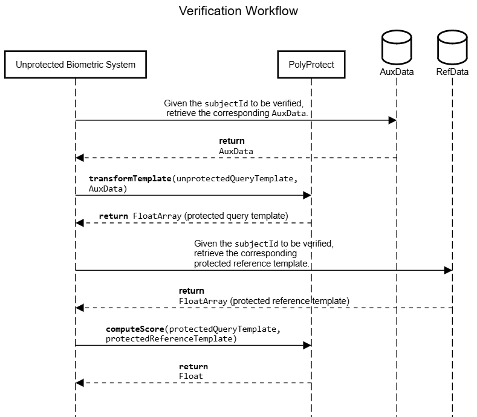

This repository contains an implementation of PolyProtect ([paper](https://arxiv.org/abs/2110.00434), [code](https://gitlab.idiap.ch/bob/bob.paper.polyprotect_2021)), a Biometric Template Protection (BTP) algorithm, in the form of an Android library (in Kotlin).

In a nutshell, PolyProtect combines subject-specific secret information (also called auxiliary data) with face templates to create a protected version of them. The auxiliary data are generated during the enrollment and they are used during the operations of verification and identification. 
The auxiliary data consist of two parts: the coefficients (an array of signed integers excluding zero) and the exponents (an array of positive signed integers). The two arrays have the same length and they are used to perform a polynomial transformation on several slices of the input (unprotected) face template. 
The output of this transformation is the protected template.

# Repository tree directory

The ```src``` folder contains two subfolders:
- ```src/main```, in which the ```PolyProtect``` class is defined.
- ```src/test/java/com/simprints/biometrics_simpolyprotect```, which contains a simple unit test with dummy templates.

# Class overview 

In this section we provide a description of the ```PolyProtect``` class.

## Data classes

- ```secretAuxDataRecord(val subjectId: String, val coefficients: IntArray, val exponents: IntArray)```: simple data class to handle the subject-specific secret parameters. The first element represents the subject's ID, the second and third element are subject-specific secret parameters used in the PolyProtect transformation, respectively corresponding to the coefficients and exponents of a polynomial function.
 
- ```protectedTemplateRecord(val subjectId: String, val protectedTemplate: DoubleArray)```: simple data class to handle the protected templates. The first element represents the subject's ID, and the second element is the protected template, _i.e._ output of the PolyProtect transformation.

## Methods

- ```transformTemplate(subjectId: String, unprotectedTemplate: DoubleArray, subjectSecretAuxData: secretAuxDataRecord): protectedTemplateRecord```: method to transform the unprotected template using the PolyProtect algorithm. Internally, the method uses the ```_OVERLAP``` variable.

- ```generateSecretAuxDataRecord(subjectId: String): secretAuxDataRecord```: method to randomly generate secret coefficients and exponents (auxiiliary data). Internally, the method uses the ```_POLYNOMIALDEGREE``` and ```_COEFFICIENTABSMAX``` variables.

- ```computeScore(array1: DoubleArray, array2: DoubleArray): Double```: method to generate a score in the [0,1] range based on cosine distance.

## Variables

- ```_POLYNOMIALDEGREE: Int = 7```: degree of the polynomial used in the PolyProtect transformation. The minimum value which would provide any security is 5, since there is no closed form algebraic expression for solving polynomials of degree 5 or higher with arbitrary coefficients.
  <ins>This variable has an important impact on the system design as it defines the maximum number of subjects that can be enrolled with different sets of exponents</ins>, which are *half* of the secret on which PolyProtect relies (the other half would be given by the polynomial coefficients). Such number is computed as the factorial of ```_POLYNOMIALDEGREE```. For example, if ```_POLYNOMIALDEGREE = 7```, then ```_POLYNOMIALDEGREE!``` = 5040. That is, with ```_POLYNOMIALDEGREE``` being 7 the maximum number of subjects that can be enrolled in the database is 5040. The maximum value for ```_POLYNOMIALDEGREE``` is 14. Although required with an ```assert``` in the setter, the upper limit of ```_POLYNOMIALDEGREE``` is bound by the fact that the embeddings produced by NN-based feature extractors often consist of floating point values smaller than 1, which would cause large powers to effectively obliterate certain embedding elements during the PolyProtect transformation. However, 14! = 87,178,291,200 which would cover over ten times the entire world population.
  At the bottom of this page it is possible to find a [table of factorials](#table-of-factorials) for the [5,14] range. In the original paper, ```_POLYNOMIALDEGREE``` is named *m*.

- ```_COEFFICIENTABSMAX: Int = 100```: range limit for the coefficients of the polynomial used in the PolyProtect transformation. The coefficients will be drawn from the [-```_COEFFICIENTABSMAX```, ```_COEFFICIENTABSMAX```] range excluding 0.

- ```_OVERLAP: Int = 2```: overlap of the intervals of the unprotected template to transform using the PolyProtect polynomial transformation. It has an impact on the security _vs._ recognition accuracy tradeoff. Specifically, as you increase the ```_OVERLAP```, the accuracy of the system improves and the security of protected template decreases. It can go from 0 to ```_POLYNOMIALDEGREE``` - 1. The safest options would be: {0, 1, 2, 3}.

**NOTE 1**: All three variables are provided with getter/setter methods.

**NOTE 2**: The size of the protected templates depends on ```_POLYNOMIALDEGREE``` and ```_OVERLAP```.

# Workflow

In this section we report the sequence diagrams are included for integrating PolyProtect in the opserations of enrolment, verification, and indentification.

## Enrolment

During a subject's enrolment, firstly, a set of coefficients and exponents (```secretAuxDataRecord``` data class) are randomly generated by the ```generateSecretAuxDataRecord``` method. 
Secondly, it is necessary to check that the same coefficients and exponents have not been assigned to previously enrolled subjects by reading the auxiliary data database, where they are stored.
Once this check is completed, the auxiliary data can be saved in the database. Then, the unprotected template can be transformed with PolyProtect using the ```transformTemplate``` method. The output of this operation is the protected template, which can be saved in a separate database for protected templates.
The unprotected template should NOT be stored.


**NOTE:** The process of verifying that the coefficients and exponents randomly drawn have not been assigned to any previously enrolled subject does not have to necessarily take place in the form of a while loop.

## Verification

For verification, the ```subjectId``` of the subject whose identity is about to be verified is known. Consequently, we read the auxiliary data database to obtain the corresponding ```secretAuxDataRecord```.
Then, we transform the unprotected query template so that it can be compared directly with the protected reference (enrolment) template with the ```transformTemplate``` method. Consequently, we read the protected template database and we return the ```protectedTemplateRecord```.
The matching of the two templates is carried out using the ```computeScore``` method, which returns a score in the [0, 1] range, being 1 a perfect match.



## Identification 

For identification, the ```subjectId``` of the subject whose identity is about to be verified is not known. Consequently, it is necessary to consider all ```secretAuxDataRecord``` stored. For this reason, we implement a for loop in the sequence diagram below. First, we initialise a list in which the scores and the corresponding ```subjectIds``` can be stored. In each iteration of the for loop, one enrolled subject per time is considered.
Their ```secretAuxDataRecord``` is obtained from the database and used to transform the unprotected query template.
Then, the ```protectedTemplateRecord``` corresponding to the ```secretAuxDataRecord``` of this iteration is retrieved so that it can be compared directly with the protected query template. 
The matching of the two templates is carried out using the ```computeScore``` method, which returns a score in the [0, 1] range, being 1 a perfect match. In each iteration, the score is appended to the previously created list together with the ```subjectId```.
Finally, the list is sorted by the score and the N most similar matches are considered.


# Table of factorials

| *x* (corresponding to ```_POLYNOMIALDEGREE```) | *x!* (corresponding to maximum number of enrolled subjects) |
| :------: | :----: |
| 5 | 120 |
| 6 | 720 |
| 7 | 5,040 |
| 8 | 40,320 |
| 9 | 362,880 |
| 10 | 3,628,800 |
| 11 | 39,916,800 |
| 12 | 479,001,600 |
| 13 | 6,227,020,800 |
| 14 | 87,178,291,200 |
